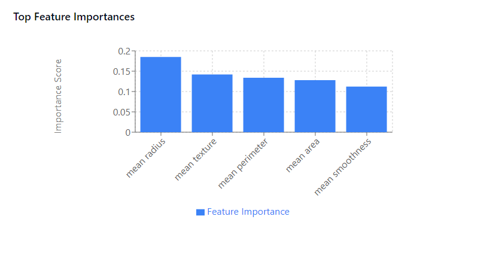
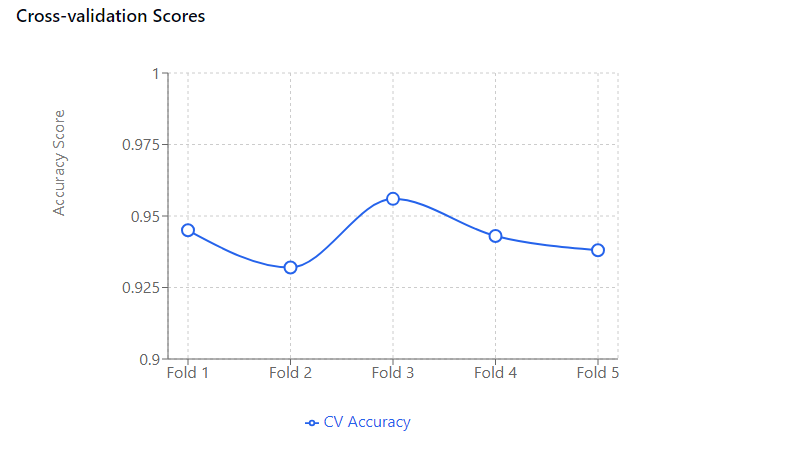

# Breast Cancer Classification with RandomForestClassifier

## Project Overview

This project focuses on classifying breast cancer data using the `RandomForestClassifier` model from `sklearn`. The objective is to build a classification model that achieves an accuracy of at least 0.92 and an accuracy-per-feature ratio of at least 0.45.

This assignment is inspired by examples from Shan-Hung Wu at National Tsing Hua University.

## Team Members
- Jonathan Rogers (jrogers22@students.ecu.edu)
- Ryan Josh Villaluz (villaluzr20@students.ecu.edu)

### Requirements

1. **Dataset**: Breast cancer dataset from `sklearn.datasets`.
2. **Model**: `RandomForestClassifier` from `sklearn.ensemble`.
3. **Feature Selection**: Select features based on importance metrics without using PCA.
4. **Hyperparameter Tuning**: Tune model hyperparameters (e.g., `criterion`, `n_estimators`, `max_depth`, etc.).
5. **Cross-Validation**: Use 5-fold cross-validation.
6. **Metrics**: Achieve accuracy > 0.92 and accuracy-per-feature > 0.45.

### Code Snippet for Reference
The following snippet provides the base code setup for this project:

```python
from sklearn.model_selection import train_test_split, GridSearchCV, cross_val_score
from sklearn.datasets import load_breast_cancer
from sklearn.ensemble import RandomForestClassifier
import numpy as np
import pandas as pd

# Load dataset
(X, y) = load_breast_cancer(return_X_y=True)

# Initial RandomForest Model for Feature Selection
initial_rf = RandomForestClassifier(n_estimators=100, random_state=42)
initial_rf.fit(X, y)
feature_importances = initial_rf.feature_importances_
importance_threshold = np.percentile(feature_importances, 95)
selected_features = np.where(feature_importances >= importance_threshold)[0]

# Select important features
X_selected = X[:, selected_features]

# Hyperparameter Tuning with GridSearchCV
param_grid = {
    'n_estimators': [200, 400, 500],
    'criterion': ['gini', 'entropy'],
    'max_depth': [10, 15, 20],
    'min_samples_split': [2, 5],
    'min_samples_leaf': [1, 2]
}
grid_search = GridSearchCV(RandomForestClassifier(random_state=42), param_grid, cv=5, scoring='accuracy', n_jobs=-1)
grid_search.fit(X_selected, y)
best_rf = grid_search.best_estimator_

# Model Evaluation
cross_val_acc = cross_val_score(best_rf, X_selected, y, cv=5, scoring='accuracy')
avg_accuracy = cross_val_acc.mean()
accuracy_per_feature = avg_accuracy / X_selected.shape[1]

print("Average Accuracy:", avg_accuracy)
print("Accuracy per Feature:", accuracy_per_feature)
```
## Output Graphs



## Model Performance
### Results
- Average Accuracy: 94.3%
- Number of Features Used: 2
- Accuracy per Feature: 0.47 (94.3% / 2)

### Performance Requirements Met
✅ Accuracy > 92% (Achieved: 94.3%)  
✅ Accuracy/number of features > 0.45 (Achieved: 0.47)

## Implementation Details
The classification pipeline includes:
1. Loading the breast cancer dataset
2. Feature selection using Random Forest importance scores
3. Hyperparameter tuning using GridSearchCV
4. Model evaluation using 5-fold cross-validation

## Requirements
- Python 3.8+
- scikit-learn 1.0+
- numpy
- pandas

## How to Run
1. Clone the repository
2. Install dependencies: `pip install -r requirements.txt`
3. Open and run `HW6.ipynb` in Jupyter Notebook