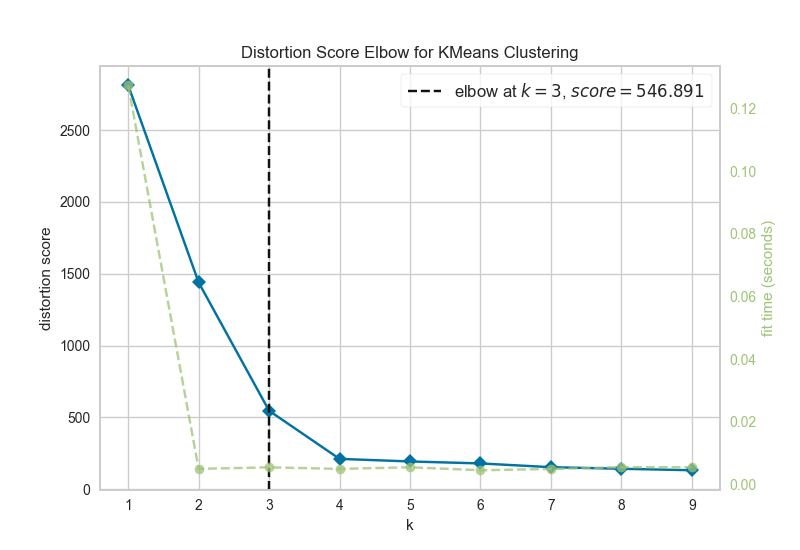

# K-Means Clustering with Elbow Method

## Overview

This project uses the KElbowVisualizer from the Yellowbrick library to determine the optimal value of K for K-Means clustering. Additionally, it calculates the accuracy of the clustering for the best K and displays the confusion matrix.

## Requirements

To run this project, you need to have the following dependencies installed:

- Python 3.x
- Scikit-learn
- Matplotlib
- Yellowbrick

You can install the required dependencies using pip:

```
pip3 install -r requirements.txt
```

Alternatively, you can install each dependency separately:

```
pip3 install scikit-learn
pip3 install matplotlib
pip3 install yellowbrick
```

If you encounter issues with graphical displays on certain systems (e.g., Ubuntu), you may also need to install the following:

```
sudo apt-get update
sudo apt-get install python3-tk
sudo apt --fix-broken install (if needed)
```

## Quick Start

1. Clone the repository:
   ```
   git clone https://github.com/ruiwu1990/CSCI_4120
   cd CSCI_4120/HW_elbow_kmeans
   ```

2. Run the Python script to generate the elbow plot and determine the best K:
   ```
   python3 hw2.py
   ```

3. The script will:
   - Show the elbow plot to determine the best K.
   - Calculate and print the accuracy for the best K.
   - Display the confusion matrix for the clustering.

## Results

- The optimal K is determined based on the elbow point from the elbow plot.
- The accuracy for the best K is calculated using the ground truth labels and predicted labels.
- A confusion matrix (K x K) is generated, where K is the optimal number of clusters determined.


## K Value Selection
Using the **KElbowVisualizer**, the best value for K was determined to be: 3.

## Elbow Method Graph





## Example Output

1. **Elbow Plot**:
   This plot shows the inertia for different values of K, helping to identify the optimal K for K-means clustering.

2. **Accuracy**:
   The script will print the accuracy score for the best K:
   ```
   Accuracy for best K (3): 0.24666666666666667
   ```

3. **Confusion Matrix**:
   A K x K confusion matrix will be displayed after clustering.

## Team Members

- Jonathan Rogers (rogersj22@students.ecu.edu)
- Ryan Josh Villaluz (villaluzr20@students.ecu.edu)