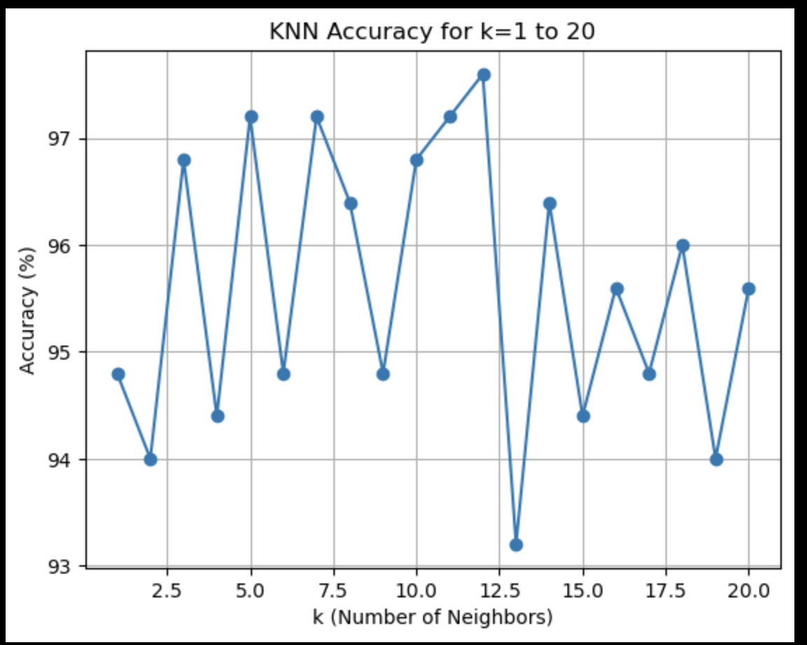

# k-Nearest Neighbors (kNN) from Scratch in Python

## Team Members
- **[Jonathan Rogers]**: [rogersj22@students.ecu.edu]
- **[Ryan Josh Villaluz]**: [villaluzr20@students.ecu.edu]

## Quick Start

### Prerequisites

- Python 3.x
- The following Python libraries are required:
  - `pandas`
  - `scikit-learn`
  - `matplotlib`
  - `numpy`
  
You can install these dependencies by running:
```bash
pip install pandas scikit-learn matplotlib numpy

```
# Running the Code
## 1. Clone the Repository
```bash
git clone https://github.com/[your-repo]/knn-project.git
cd knn-project
```
## 2. Run the knn.py file
```bash 
python knn.py
```
This will load the Iris dataset, perform kNN for different values of k (1-20), and display the accuracy results along with a line chart comparing the accuracy of each k.

## Dataset
The code uses the Iris dataset, which can be found here: https://raw.githubusercontent.com/ruiwu1990/CSCI_4120/master/KNN/iris.data

# Whick K Works the Best?
Based on the results, we found that:

* The highest accuracy was achieved at k=12 with an accuracy of 97.60%.
* Other values of k that performed well include k=5, k=7, and k=11 with accuracies above 97%.

## Why Similar Results Across Multiple K Values?
The similar accuracy results across different values of k are likely due to the fact that the Iris dataset is relatively simple and well-separated between classes. This causes the model to perform consistently well even as the number of neighbors (k) varies. For smaller datasets like Iris, large values of k might not introduce much variance in performance because the distance between points is still relatively distinct.

# Accuracy Results
Here are the accuracy percentages for each k from 1 to 20:
* k=1: 94.80%
* k=2: 94.00%
* k=3: 96.80%
* k=4: 94.40%
* k=5: 97.20%
* k=6: 94.80%
* k=7: 97.20%
* k=8: 96.40%
* k=9: 94.80%
* k=10: 96.80%
* k=11: 97.20%
* k=12: 97.60%
* k=13: 93.20%
* k=14: 96.40%
* k=15: 94.40%
* k=16: 95.60%
* k=17: 94.80%
* k=18: 96.00%
* k=19: 94.00%
* k=20: 95.60%

# Line Chart
The line chart showing the accuracy for each value of k is generated at the end of the script. Here's an example of what it looks like:



