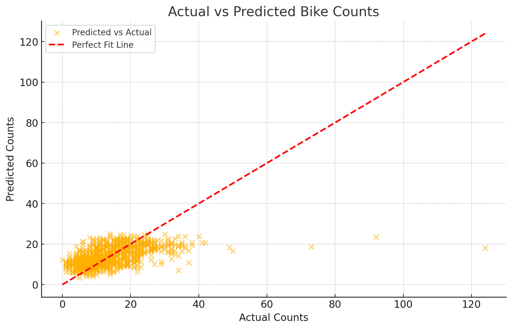

# Bicycle Traffic Prediction with Regularization Models

This project compares three regression models—**Linear Regression**, **Lasso Regression**, and **Ridge Regression**—to predict bicycle traffic on the Fremont Bridge. The models are evaluated using cross-validation scores, and the optimal alpha values for Lasso and Ridge models are determined using `RandomizedSearchCV`.

## Required Items
1. **Team Member Names and Email Addresses**
2. **Cross-Validation Scores for All Three Models**
3. **Alpha Values for Lasso and Ridge Models**
4. **Best Performing Model**

## Team Members
- **Jonathan Rogers** - jrogers22@students.ecu.edu
- **Ryan Villaluz** - villaluzr20@students.ecu.edu

## Model Performance Summary

- **Linear Regression**:
  - Mean Cross-Validation Score (MSE): -60.51

- **Lasso Regression**:
  - Best Cross-Validation Score (MSE): -60.10
  - Best Alpha: 1.76

- **Ridge Regression**:
  - Best Cross-Validation Score (MSE): -60.12
  - Best Alpha: 6866.49

### Best Performing Model
Based on the cross-validation scores, the **Lasso Regression** model performs the best, achieving the lowest Mean Squared Error (MSE) of -60.10.

---

### Grading Criteria
1. **Model Scores**: Each model's cross-validation score is listed (3 points each) — Total: **9 points**
2. **Alpha Values**: Stated alpha for Lasso and Ridge (2 points each) — Total: **4 points**
3. **Best Model**: Clearly indicated the best-performing model (4 points) — Total: **4 points**

---

