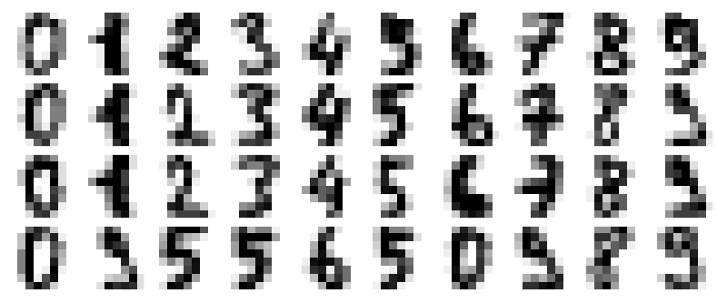
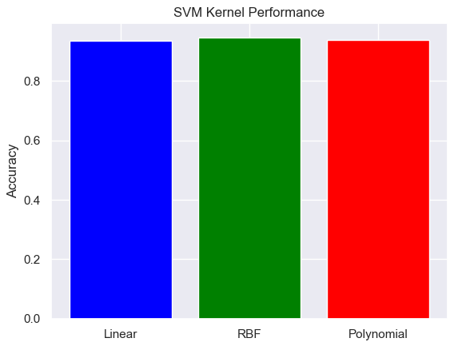

# Digit Classification with SVM

## Overview
This project uses Support Vector Machine (SVM) models to classify handwritten digits from the `digits` dataset. The aim is to compare the performance of linear, radial basis function (RBF), and polynomial kernels, with hyperparameter tuning and dimensionality reduction techniques applied.

---

## Objectives
- Classify digits using SVM models.
- Compare the performance of linear, radial, and polynomial kernels in terms of classification accuracy.
- Tune kernel parameters using the `RandomizedSearchCV` method.
- Reduce data dimensionality using PCA while retaining 80% of the information.
- Evaluate models with 5-fold cross-validation to determine final accuracy.

---

## Implementation Steps
1. **Dataset Preparation**: Load and preprocess the `digits` dataset.
2. **Feature Scaling**: Normalize features using `StandardScaler`.
3. **Dimensionality Reduction**: Apply PCA to reduce the dataset dimensionality while retaining 80% of variance.
4. **Model Training**:
   - Train SVM models with linear, RBF, and polynomial kernels.
   - Use `RandomizedSearchCV` to optimize hyperparameters for each kernel.
5. **Performance Evaluation**:
   - Perform 5-fold cross-validation to compute mean accuracy for each kernel.
   - Compare accuracies and visualize results using a bar chart.

---
---
# Digit Data

---
## Parameters Selected
### Linear Kernel
- `C`: Selected via RandomizedSearchCV.

### Radial Basis Function (RBF) Kernel
- `C`: Selected via RandomizedSearchCV.
- `gamma`: Selected via RandomizedSearchCV.

### Polynomial Kernel
- `C`: Selected via RandomizedSearchCV.
- `gamma`: Selected via RandomizedSearchCV.
- `degree`: Selected via RandomizedSearchCV.

---

## Results
| Kernel       | Accuracy |
|--------------|----------|
| Linear       | 0.94     |
| RBF          | 0.95     |
| Polynomial   | 0.94     |

The RBF kernel demonstrated the best performance, achieving an accuracy of 95%.

---

## Visualization
A bar chart was used to compare the classification accuracies of the kernels.



---

## Team Members

- **Jonathan Rogers**  
  Email: rogersj22@students.ecu.edu

- **Ryan Josh Villaluz**  
  Email: villaluzr20@students.ecu.edu

---

## Prerequisites
- Python 3.x
- Libraries: `numpy`, `matplotlib`, `scipy`, `sklearn`, `seaborn`

---

## Instructions to Run
1. Clone the repository and navigate to the project directory.
2. Install required libraries:
   ```bash
   pip install numpy matplotlib scipy sklearn seaborn
